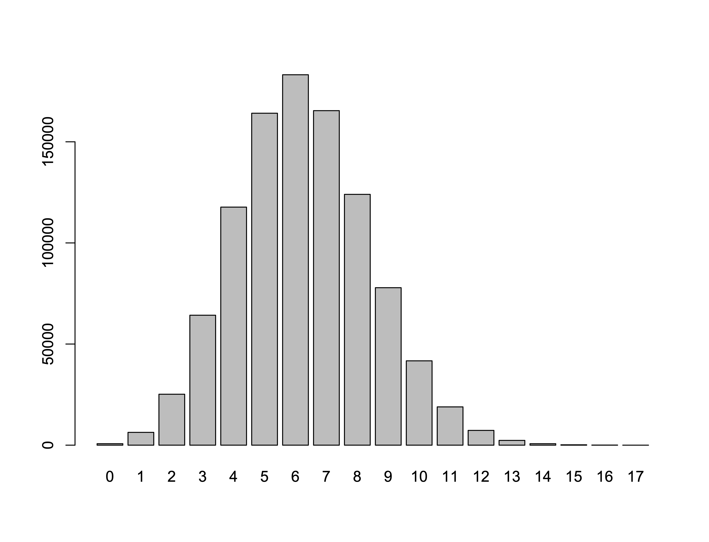
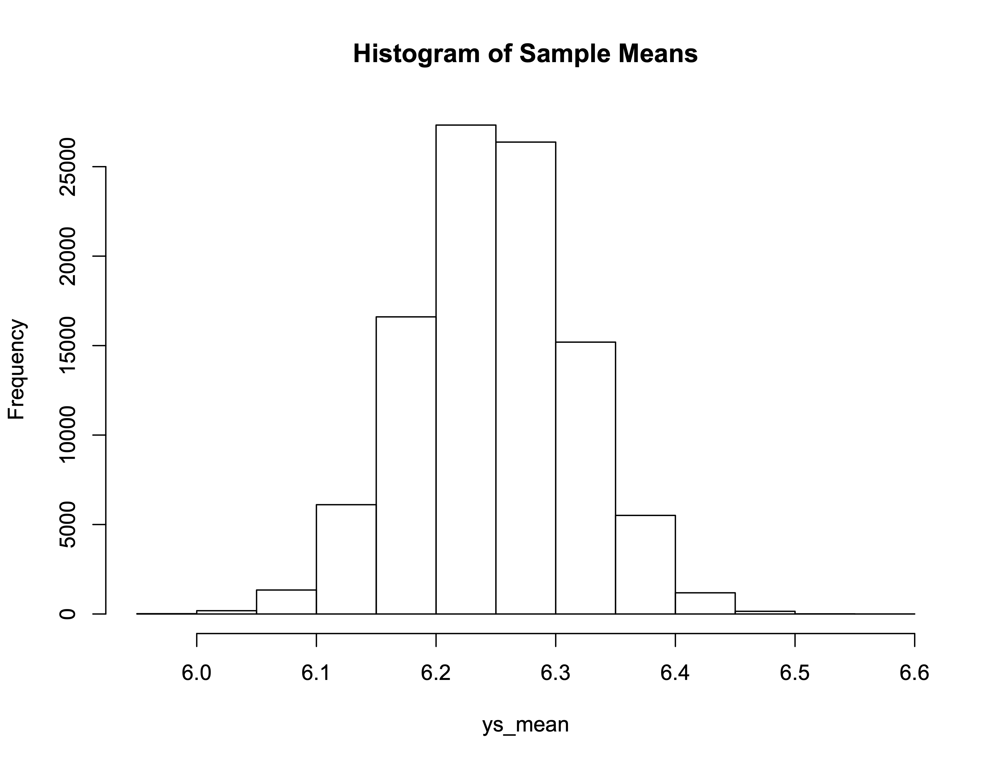
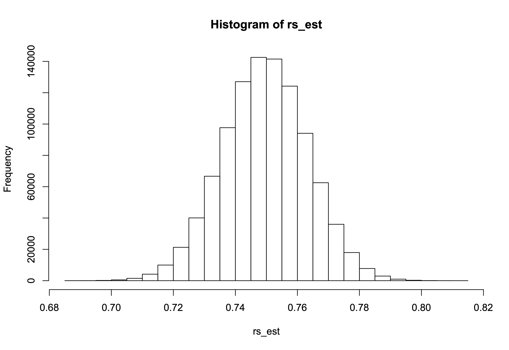
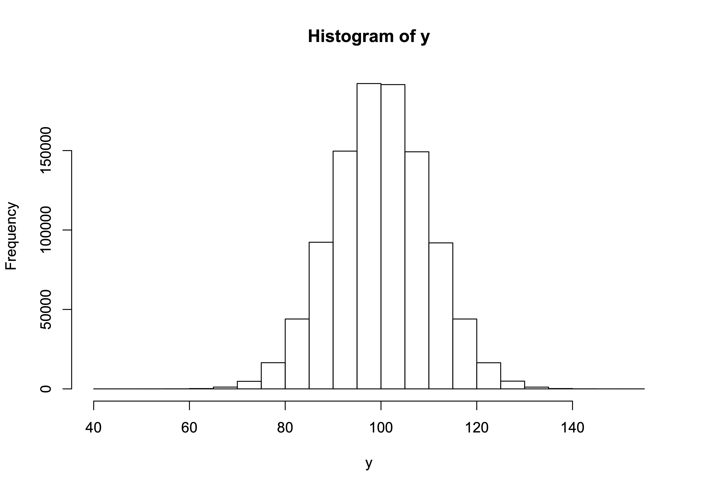
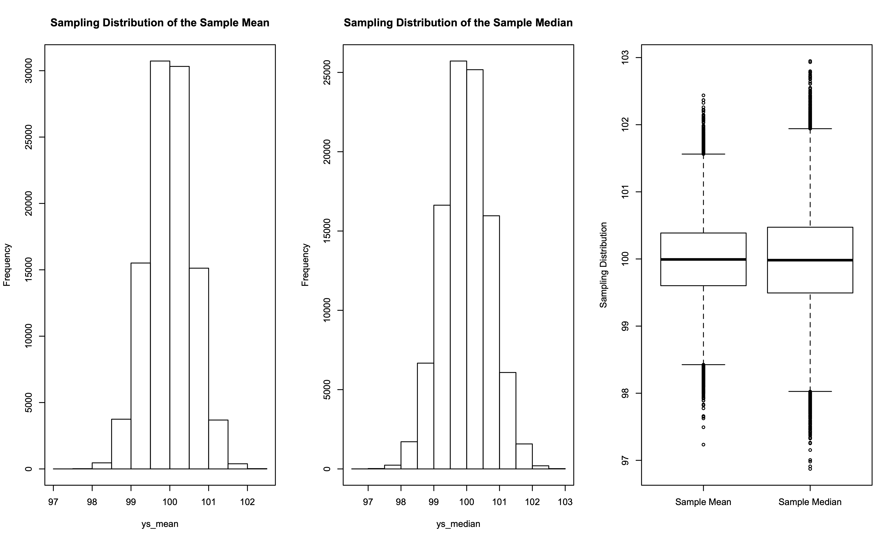
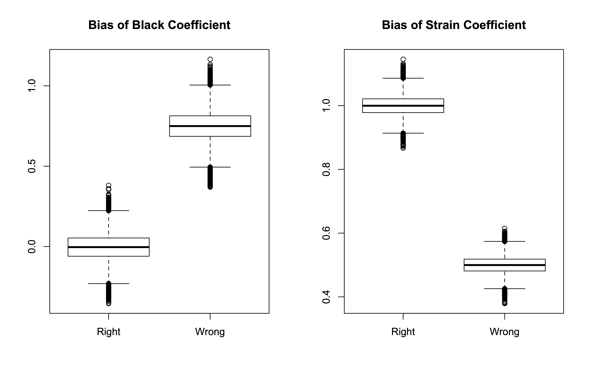

## Lesson 2 - Thursday 9/8/22

Part 1: Today's topic is inference. Science is an enterprise that seeks generalizable knowledge. In other words, we want to estimate scientifically interesting parameters -- using finite data sets -- and apply what we have learned to a scientifically interesting population. Inference is the "apply that information to scientifically interesting populations" part of this exercise. Normatively, we expect a compelling scientific presentation to include a parameter estimate (or estimates) accompanied by a principled measure of uncertainty; this information becomes the basis for us to apply our results to some broader population. Reading that is useful for this discussion comes from Wasserman (2004, Chapters 6-9).

### A. Estimating a Population Mean

Let's suppose there is a large population (1 million people) of prison releasees. Each prison releasee has some number, *y*, which is a count of prior convictions. Here is the population distribution of *y*:

```R
y <- c(rep(0,721),
       rep(1,6328),
       rep(2,25187),
       rep(3,64254),
       rep(4,117711),
       rep(5,164136),
       rep(6,183155),
       rep(7,165408),
       rep(8,124012),
       rep(9,77863),
       rep(10,41700),
       rep(11,18928),
       rep(12,7299),
       rep(13,2356),
       rep(14,719),
       rep(15,175),
       rep(16,45),
       rep(17,3))
table(y)
```

and the output is:

```Rout
> y <- c(rep(0,721),
+        rep(1,6328),
+        rep(2,25187),
+        rep(3,64254),
+        rep(4,117711),
+        rep(5,164136),
+        rep(6,183155),
+        rep(7,165408),
+        rep(8,124012),
+        rep(9,77863),
+        rep(10,41700),
+        rep(11,18928),
+        rep(12,7299),
+        rep(13,2356),
+        rep(14,719),
+        rep(15,175),
+        rep(16,45),
+        rep(17,3))
> table(y)
y
     0      1      2      3      4      5      6      7      8 
   721   6328  25187  64254 117711 164136 183155 165408 124012 
     9     10     11     12     13     14     15     16     17 
 77863  41700  18928   7299   2356    719    175     45      3 
> 
```

Here is a barplot showing the empirical distribution of *y* in the population.

<p align="center">

</p>

Now, suppose we want to answer the following question: "what is the mean value of *y* in this population?" The R code is:

```R
mean(y)
```

and the answer is:

```Rout
> mean(y)
[1] 6.247523
> 
```

Now, let's draw a single sample of size n=[sampsize] from this
population (with replacement) and calculate the sample mean and
standard error of the mean for that single sample:

```R
sampsize <- 1000
yss <- sample(y,size=sampsize,replace=T)
mean(yss)
sd(yss)/sqrt(sampsize)
```

and the output is:

```R
> sampsize <- 1000
> yss <- sample(y,size=sampsize,replace=T)
> mean(yss)
[1] 6.134
> sd(yss)/sqrt(sampsize)
[1] 0.066667
> 
```

Next, let's repeat this process [nsamples] times

```
nsamples <- 100000

ys_mean <- vector()
se_mean <- vector()

for(i in 1:nsamples)
  {
   ys <- sample(y,size=sampsize,replace=T)
   ys_mean[i] <- mean(ys)
   se_mean[i] <- sd(ys)/sqrt(sampsize)
   }

# look at the results

mean(ys_mean)
sd(ys_mean)
mean(se_mean)
```

and the output is:

```Rout
> nsamples <- 100000
> 
> ys_mean <- vector()
> se_mean <- vector()
> 
> for(i in 1:nsamples)
+   {
+    ys <- sample(y,size=sampsize,replace=T)
+    ys_mean[i] <- mean(ys)
+    se_mean[i] <- sd(ys)/sqrt(sampsize)
+    }
> 
> # look at the results
> 
> mean(ys_mean)
[1] 6.248071
> sd(ys_mean)
[1] 0.06845787
> mean(se_mean)
[1] 0.06843183
> 
```

Let's also look at a histogram of the sample means:

```R
hist(ys_mean,main="Histogram of Sample Means")
```

and the output is:

<p align="center">

</p>

As we can see, the mean of the standard errors is very close to the standard deviation of the sample means - which is what we expect. 

### B. Estimating a Population Proportion

Let's suppose there is a large population (1 million people) of prison releasees. Further suppose that 750,000 of these releasees get rearrested within 5 years of release -- implying a 75% recidivism rate. Here is the R code to enter the data:

```R
r <- c(rep(0,250000),rep(1,750000))
mean(r)
```

and the output is:

```Rout
> r <- c(rep(0,250000),rep(1,750000))
> mean(r)
[1] 0.75
> 
```

Next, we draw a sample of 1000 people from the original population and we calculate the recidivism rate and the standard error of the recidivism rate for the sample data:

```R
sampsize <- 1000
rss <- sample(r,size=sampsize,replace=T)
mean(rss)
sqrt(mean(rss)*(1-mean(rss))/sampsize)
```

and the output is:

```Rout
> sampsize <- 1000
> rss <- sample(r,size=sampsize,replace=T)
> mean(rss)
[1] 0.75
> sqrt(mean(rss)*(1-mean(rss))/sampsize)
[1] 0.01369306
> 
```

Let's see how this compares to the actual sampling distribution:

```R
nsamples <- 100000

rs_est <- vector()
rs_std <- vector()

for(i in 1:nsamples)
  {
   rs <- sample(r,size=sampsize,replace=T)
   rs_est[i] <- mean(rs)
   rs_std[i] <- sqrt(mean(rs)*(1-mean(rs))/sampsize)
   }

# look at the results

mean(rs_est)
sd(rs_est)
mean(rs_std)
```

and the output is:

```Rout
> nsamples <- 100000
> 
> rs_est <- vector()
> rs_std <- vector()
> 
> for(i in 1:nsamples)
+   {
+    rs <- sample(r,size=sampsize,replace=T)
+    rs_est[i] <- mean(rs)
+    rs_std[i] <- sqrt(mean(rs)*(1-mean(rs))/sampsize)
+    }
> 
> # look at the results
> 
> mean(rs_est)
[1] 0.750027
> sd(rs_est)
[1] 0.01377905
> mean(rs_std)
[1] 0.01368331
> 
```

Let's now introduce the idea of a confidence interval. For each of our samples, let's calculate a 95% confidence interval around our point estimate. Then, let's see how often our confidence interval actually traps the true population recidivism rate of 0.75.

```R
nsamples <- 1000000

rs_est <- vector()
rs_std <- vector()
rs_lcl <- vector()
rs_ucl <- vector()

mult <- qnorm(p=0.975)
mult

for(i in 1:nsamples)
  {
   rs <- sample(r,size=sampsize,replace=T)
   rs_est[i] <- mean(rs)
   rs_std[i] <- sqrt(mean(rs)*(1-mean(rs))/sampsize)
   rs_lcl[i] <- rs_est[i]-mult*rs_std[i]
   rs_ucl[i] <- rs_est[i]+mult*rs_std[i]
   }

# look at the results

mean(rs_est)
sd(rs_est)
mean(rs_std)
cl <- data.frame(rs_lcl,rs_ucl)
cl$flag <- rep(NA,nrow(cl))
cl$flag[rs_lcl<=0.75 & rs_ucl>=0.75] <- 1
cl$flag[rs_lcl>=0.75 | rs_ucl<=0.75] <- 0
table(cl$flag)
hist(rs_est)
```

and the output is:

```Rout
> nsamples <- 1000000
> 
> rs_est <- vector()
> rs_std <- vector()
> rs_lcl <- vector()
> rs_ucl <- vector()
> 
> mult <- qnorm(p=0.975)
> mult
[1] 1.959964
> 
> for(i in 1:nsamples)
+   {
+    rs <- sample(r,size=sampsize,replace=T)
+    rs_est[i] <- mean(rs)
+    rs_std[i] <- sqrt(mean(rs)*(1-mean(rs))/sampsize)
+    rs_lcl[i] <- rs_est[i]-mult*rs_std[i]
+    rs_ucl[i] <- rs_est[i]+mult*rs_std[i]
+    }
> 
> # look at the results
> 
> mean(rs_est)
[1] 0.7500165
> sd(rs_est)
[1] 0.01368219
> mean(rs_std)
[1] 0.01368364
> cl <- data.frame(rs_lcl,rs_ucl)
> cl$flag <- rep(NA,nrow(cl))
> cl$flag[rs_lcl<=0.75 & rs_ucl>=0.75] <- 1
> cl$flag[rs_lcl>=0.75 | rs_ucl<=0.75] <- 0
> table(cl$flag)

     0      1 
 53230 946770 
> 

```

<p align="center">

</p>

Part 2: We now turn to the issue of estimator properties. Specifically, we will be looking at efficiency, bias, and consistency.  Efficiency is an index of sampling variability; in general, we are looking for estimators that are as efficient as possible (smallest sampling variability). Bias is an index of how close the average of the sampling distribution for a population parameter estimate is to the actual correct and true value of the population parameter. Consistent estimators are biased in small samples but the bias vanishes as the sample size increases. Relevant readings for the ideas discussed in this section are:

* Wasserman (2004): Sections 9.4-9.8
* King (1989): Section 4.4

#### A. Efficiency

Suppose we have a population (N = 1M) distribution of *y* that is normally distributed with a mean of ~100 and a standard deviation of ~10. We can generate this distribution by:

```R
set.seed(279416)
y <- rnorm(n=1000000,mean=100,sd=10)
mean(y)
sd(y)
hist(y)
```

The output is:

```Rout
> set.seed(279416)
> y <- rnorm(n=1000000,mean=100,sd=10)
> mean(y)
[1] 99.99395
> sd(y)
[1] 9.99117
> hist(y)
```

and the population histogram is:

<p align="center">

</p>

Now, suppose we draw random samples of size N = 300 from this population and that we calculate both the mean and median for each sample. Further suppose that we let both the sample mean and the sample median be estimators of the population mean in each sample. Then, we will have two sampling distributions: one for the mean and one for the median. Which estimator performs "better"?

```R
# Calculate population mean

popmean <- mean(y)

# draw a single sample of size n=[sampsize] 
# from the population with replacement

sampsize <- 300
yss <- sample(y,size=sampsize,replace=T)

# calculate the sample mean 

mean(yss)

# calculate the sample median 

median(yss)

# now, let's repeat this process [nsamples] times

nsamples <- 100000

ys_mean <- vector()
se_mean <- vector()
ys_median <- vector()

for(i in 1:nsamples)
  {
   ys <- sample(y,size=sampsize,replace=T)
   ys_mean[i] <- mean(ys)
   se_mean[i] <- sd(ys)/sqrt(sampsize)
   ys_median[i] <- median(ys)
   }

# calculate the mean squared error (mse)

ys_mean_mse <- sum((ys_mean-popmean)^2)/nsamples
ys_median_mse <- sum((ys_median-popmean)^2)/nsamples

# look at the results

c(mean(ys_mean),sd(ys_mean),ys_mean_mse)
c(mean(ys_median),sd(ys_median),ys_median_mse)
mean(se_mean)
median(se_mean)

# charts

par(mfrow=c(1,3))
hist(ys_mean,main="Sampling Distribution of the Sample Mean")
box()
hist(ys_median,main="Sampling Distribution of the Sample Median")
box()
boxplot(ys_mean,ys_median,xaxt="n",ylab="Sampling Distribution")
axis(side=1,at=c(1,2),labels=c("Sample Mean","Sample Median"))
```

and here is the output:

```Rout
> # Calculate population mean
> 
> popmean <- mean(y)
> 
> # draw a single sample of size n=[sampsize] 
> # from the population with replacement
> 
> sampsize <- 300
> yss <- sample(y,size=sampsize,replace=T)
> 
> # calculate the sample mean 
> 
> mean(yss)
[1] 98.86404
> 
> # calculate the sample median 
> 
> median(yss)
[1] 99.47211
> 
> # now, let's repeat this process [nsamples] times
> 
> nsamples <- 100000
> 
> ys_mean <- vector()
> se_mean <- vector()
> ys_median <- vector()
> 
> for(i in 1:nsamples)
+   {
+    ys <- sample(y,size=sampsize,replace=T)
+    ys_mean[i] <- mean(ys)
+    se_mean[i] <- sd(ys)/sqrt(sampsize)
+    ys_median[i] <- median(ys)
+    }
> 
> # calculate the mean squared error (mse)
> 
> ys_mean_mse <- sum((ys_mean-popmean)^2)/nsamples
> ys_median_mse <- sum((ys_median-popmean)^2)/nsamples
> 
> # look at the results
> 
> c(mean(ys_mean),sd(ys_mean),ys_mean_mse)
[1] 99.9942200  0.5776531  0.3336798
> c(mean(ys_median),sd(ys_median),ys_median_mse)
[1] 99.9827350  0.7208414  0.5197331
> mean(se_mean)
[1] 0.5764864
> median(se_mean)
[1] 0.5762423
> 
> # charts
> 
> par(mfrow=c(1,3))
> hist(ys_mean,main="Sampling Distribution of the Sample Mean")
> box()
> hist(ys_median,main="Sampling Distribution of the Sample Median")
> box()
> boxplot(ys_mean,ys_median,xaxt="n",ylab="Sampling Distribution")
> axis(side=1,at=c(1,2),labels=c("Sample Mean","Sample Median"))
> 
```

And, here are 3 charts created by the program:

<p align="center">

</p>

#### B. Bias

To illustrate bias, we simulate a relatively simple regression problem. Let's suppose we have a population of 1M people; the dependent variable is a measure of future criminality and there are 2 independent variables: (1) race; and (2) a measure of economic strain. There are three issues that a researcher looking at this equation would need to confront: (1) race and economic strain might both be correlated with future criminality; (2) race and economic strain might be correlated with each other; and (3) race is probably measured better than economic strain. Here is some R code:

```R
options(scipen=100000)
set.seed(279416)
u1 <- rnorm(n=1000000,mean=0,sd=1)
u2 <- rnorm(n=1000000,mean=0,sd=1)
e <- rnorm(n=1000000,mean=0,sd=1)
black <- rbinom(n=1000000,size=1,prob=0.3)
true.strain <- 10+1.5*black+u1
measured.strain <- true.strain+u2
y <- 10+0*black+true.strain+e
reg.model1 <- lm(y~1+black+true.strain)
summary(reg.model1)
reg.model2 <- lm(y~1+black+measured.strain)
summary(reg.model2)
```

and here are the population results:

```Rout
> options(scipen=100000)
> set.seed(279416)
> u1 <- rnorm(n=1000000,mean=0,sd=1)
> u2 <- rnorm(n=1000000,mean=0,sd=1)
> e <- rnorm(n=1000000,mean=0,sd=1)
> black <- rbinom(n=1000000,size=1,prob=0.3)
> true.strain <- 10+1.5*black+u1
> measured.strain <- true.strain+u2
> y <- 10+0*black+true.strain+e
> reg.model1 <- lm(y~1+black+true.strain)
> summary(reg.model1)

Call:
lm(formula = y ~ 1 + black + true.strain)

Residuals:
    Min      1Q  Median      3Q     Max 
-4.6273 -0.6749  0.0000  0.6743  4.6135 

Coefficients:
             Estimate Std. Error t value            Pr(>|t|)    
(Intercept) 10.002722   0.010091 991.221 <0.0000000000000002 ***
black       -0.003643   0.002654  -1.373                0.17    
true.strain  0.999714   0.001002 997.533 <0.0000000000000002 ***
---
Signif. codes:  0 ‘***’ 0.001 ‘**’ 0.01 ‘*’ 0.05 ‘.’ 0.1 ‘ ’ 1

Residual standard error: 1.001 on 999997 degrees of freedom
Multiple R-squared:  0.5946,	Adjusted R-squared:  0.5946 
F-statistic: 7.333e+05 on 2 and 999997 DF,  p-value: < 0.00000000000000022

> reg.model2 <- lm(y~1+black+measured.strain)
> summary(reg.model2)

Call:
lm(formula = y ~ 1 + black + measured.strain)

Residuals:
    Min      1Q  Median      3Q     Max 
-5.6912 -0.8275  0.0005  0.8252  6.3937 

Coefficients:
                  Estimate Std. Error t value            Pr(>|t|)
(Intercept)     15.0022126  0.0087953  1705.7 <0.0000000000000002
black            0.7497580  0.0029738   252.1 <0.0000000000000002
measured.strain  0.4996217  0.0008673   576.1 <0.0000000000000002
                   
(Intercept)     ***
black           ***
measured.strain ***
---
Signif. codes:  0 ‘***’ 0.001 ‘**’ 0.01 ‘*’ 0.05 ‘.’ 0.1 ‘ ’ 1

Residual standard error: 1.226 on 999997 degrees of freedom
Multiple R-squared:  0.3927,	Adjusted R-squared:  0.3927 
F-statistic: 3.233e+05 on 2 and 999997 DF,  p-value: < 0.00000000000000022

> 
```

Now, let's draw repeated samples and estimate the two regression models in each sample:

```R
# Create the population data frame

popdf <- data.frame(y,black,true.strain,measured.strain)

# now, let's sample from the population [nsamples] times

nsamples <- 100000
sampsize <- 1000

black.coef.right <- vector()
black.coef.wrong <- vector()
strain.coef.right <- vector()
strain.coef.wrong <- vector()

for(i in 1:nsamples)
  {
   sdf <- popdf[sample(nrow(popdf),size=sampsize,replace=T), ]
   sample.reg.model1 <- lm(data=sdf,y~1+black+true.strain)
   sample.reg.model2 <- lm(data=sdf,y~1+black+measured.strain)
   black.coef.right[i] <- coef(sample.reg.model1)[2]
   black.coef.wrong[i] <- coef(sample.reg.model2)[2]
   strain.coef.right[i] <- coef(sample.reg.model1)[3]
   strain.coef.wrong[i] <- coef(sample.reg.model2)[3]
   }

# let's look at the results for the last sample

summary(sample.reg.model1)
summary(sample.reg.model2)

# calculate results

mean(black.coef.right)
sd(black.coef.right)
mean(strain.coef.right)
sd(strain.coef.right)

mean(black.coef.wrong)
sd(black.coef.wrong)
mean(strain.coef.wrong)
sd(strain.coef.wrong)

par(mfrow=c(1,2))
boxplot(black.coef.right,black.coef.wrong,
  main="Bias of Black Coefficient",
  names=c("Right","Wrong"))
boxplot(strain.coef.right,strain.coef.wrong,
  main="Bias of Strain Coefficient",
  names=c("Right","Wrong"))
```

Here is the R output:

```Rout
> # Create the population data frame
> 
> popdf <- data.frame(y,black,true.strain,measured.strain)
> 
> # now, let's sample from the population [nsamples] times
> 
> nsamples <- 100000
> sampsize <- 1000
> 
> black.coef.right <- vector()
> black.coef.wrong <- vector()
> strain.coef.right <- vector()
> strain.coef.wrong <- vector()
> 
> for(i in 1:nsamples)
+   {
+    sdf <- popdf[sample(nrow(popdf),size=sampsize,replace=T), ]
+    sample.reg.model1 <- lm(data=sdf,y~1+black+true.strain)
+    sample.reg.model2 <- lm(data=sdf,y~1+black+measured.strain)
+    black.coef.right[i] <- coef(sample.reg.model1)[2]
+    black.coef.wrong[i] <- coef(sample.reg.model2)[2]
+    strain.coef.right[i] <- coef(sample.reg.model1)[3]
+    strain.coef.wrong[i] <- coef(sample.reg.model2)[3]
+    }
> 
> # let's look at the results for the last sample
> 
> summary(sample.reg.model1)

Call:
lm(formula = y ~ 1 + black + true.strain, data = sdf)

Residuals:
    Min      1Q  Median      3Q     Max 
-3.1545 -0.6476  0.0147  0.6223  3.5763 

Coefficients:
            Estimate Std. Error t value            Pr(>|t|)    
(Intercept)  9.64714    0.31492  30.634 <0.0000000000000002 ***
black       -0.11831    0.08226  -1.438               0.151    
true.strain  1.03461    0.03118  33.185 <0.0000000000000002 ***
---
Signif. codes:  0 ‘***’ 0.001 ‘**’ 0.01 ‘*’ 0.05 ‘.’ 0.1 ‘ ’ 1

Residual standard error: 0.9699 on 997 degrees of freedom
Multiple R-squared:  0.6184,	Adjusted R-squared:  0.6177 
F-statistic:   808 on 2 and 997 DF,  p-value: < 0.00000000000000022

> summary(sample.reg.model2)

Call:
lm(formula = y ~ 1 + black + measured.strain, data = sdf)

Residuals:
    Min      1Q  Median      3Q     Max 
-3.9051 -0.8139  0.0448  0.8816  3.4579 

Coefficients:
                Estimate Std. Error t value             Pr(>|t|)    
(Intercept)     15.01061    0.28840  52.048 < 0.0000000000000002 ***
black            0.66626    0.09634   6.916      0.0000000000083 ***
measured.strain  0.50209    0.02849  17.622 < 0.0000000000000002 ***
---
Signif. codes:  0 ‘***’ 0.001 ‘**’ 0.01 ‘*’ 0.05 ‘.’ 0.1 ‘ ’ 1

Residual standard error: 1.229 on 997 degrees of freedom
Multiple R-squared:  0.3877,	Adjusted R-squared:  0.3865 
F-statistic: 315.6 on 2 and 997 DF,  p-value: < 0.00000000000000022

> 
> # calculate results
> 
> mean(black.coef.right)
[1] -0.003729556
> sd(black.coef.right)
[1] 0.08427171
> mean(strain.coef.right)
[1] 0.9998543
> sd(strain.coef.right)
[1] 0.03188875
> 
> mean(black.coef.wrong)
[1] 0.7496711
> sd(black.coef.wrong)
[1] 0.09467297
> mean(strain.coef.wrong)
[1] 0.4996718
> sd(strain.coef.wrong)
[1] 0.02753434
> 
> par(mfrow=c(1,2))
> boxplot(black.coef.right,black.coef.wrong,
+   main="Bias of Black Coefficient",
+   names=c("Right","Wrong"))
> boxplot(strain.coef.right,strain.coef.wrong,
+   main="Bias of Strain Coefficient",
+   names=c("Right","Wrong"))
> 
```

and here are the boxplots:

<p align="center">

</p>

### Assignment #1 - Monday 9/19/22 (end of the day)

1. We have the following 2x2 contingency table:

```Rout
> table(y,x)
   x
y     0   1
  0 502 444
  1 149 155
>
```

You can create a rows-and-columns dataset from this table using the following code:

```Rout
y <- c(rep(0,502),rep(0,444),rep(1,149),rep(1,155))
x <- c(rep(0,502),rep(1,444),rep(0,149),rep(1,155))
table(y,x)
```

Now, with this table in hand, carry out the following tasks:

* estimate p(y=1|x=1) and p(y=1|x=0)
* calculate the difference between the fractions (delta)
* calculate the standard error of delta
* calculate the relative risk
* calculate the odds ratio, the log odds ratio, and the standard error of the log-odds ratio
* compare your results above to what you obtain from the linear probability and logistic regression models
* calculate and interpret the Yule's Q statistic for the table

2. Consider the following distribution of *y* representing the number of prior spells of incarceration for a population of incoming prison inmates. With samples of size *N* = 300, 

* Estimate the population mean. 
* Verify that the average of the sample means is close to the population mean. 
* Display your results with a histogram.
* Calculate the average of the standard errors
* Verify that the average of the standard errors is close to the standard deviation of the sampling distribution.
* Calculate a 95% confidence intervals for each sample you draw; verify that approximately 95% of the confidence intervals contain the true value of the population mean.

```Rout
y <- c(rep(0,4886),rep(1,16339),rep(2,25573),rep(3,24704),rep(4,16297),rep(5,8169),rep(6,3013),rep(7,821),
       rep(8,164),rep(9,31),rep(10,2),rep(11,1))
```

3. For the efficiency problem above, convince yourself that the mean is still more efficient than the median even when the sample size is large (i.e., N = 1000).

4. The idea of bias is that inaccuracy doesn't improve with larger sample sizes. Increase the (repeated) sample size by a factor of 2 and see how your conclusions change (if at all).

5. For the consistency problem, change the population intercept from zero to -0.25 and reestimate the experiments. Describe how (if at all) your conclusions change.
